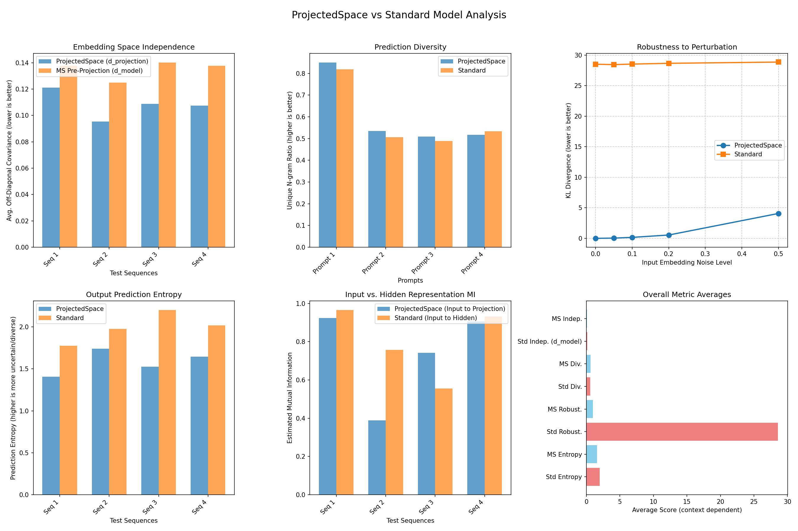

# Orthogonal Transformer

## From an information dynamics perspective, standard Transformers learn an implicit latent ontology (a system of representing concepts and their relationships) through end-to-end optimization. Through orthogonal feature independence—we can promote the emergence of a more parsimonious or compositionally-structured ontology.

This repository explores methods for influencing the learned latent representations within Transformer architectures, primarily by leveraging or encouraging orthogonality and structured transformations. The goal is to investigate paths towards more disentangled, robust, and interpretable models.

Two main approaches are currently explored:

1. **Baseline Orthogonal Model:** Implemented in `orthogonal_transformer_model.py` and tested via `test_orthogonal_transformer.py`. This model uses a learnable orthogonal transformation applied directly to token embeddings.

2. **Architectural Exploration - Projected Space Model:** Implemented in `projected_space_transformer_model.py` and tested via `test_projected_space_transformer.py`. This model applies double orthogonal transformations, creating a "projected space" where all transformer operations occur.

---

## Results Summary

Both models significantly outperform the standard transformer baseline:

| Model | Perplexity ↓ | Independence ↓ | Diversity ↑ | Robustness ↓ |
|-------|------------|----------------|-------------|--------------|
| **Orthogonal** | **4.83** | **0.1224** | **0.5986** | **0.0000** |
| **Projected Space** | **4.73** | **0.1082** | **0.6023** | **0.9623** |
| Standard | 6.63 | 0.2173 | 0.5797 | 28.5906 |

---

## 1. Baseline Orthogonal Model (`orthogonal_transformer_model.py`)

This approach focuses on applying a learnable orthogonal transformation directly to the token embeddings and processing sequences in this transformed "inverse" space.

### Key Visualizations (Baseline Orthogonal Model)

#### Character Embedding Point Cloud
This plot visualizes the 2D PCA-reduced character embeddings from sample words, comparing embeddings before ("Standard") and after ("Inverse/Orthogonal") the orthogonal transformation.


#### Comprehensive Metric Analysis
Compares the baseline orthogonal model against a standard Transformer on various metrics.


### Results (Baseline Orthogonal Model)

**PERPLEXITY (wikitext validation - 500 samples):**
- Orthogonal Model: **4.83**
- Standard Model: 6.63

**EMBEDDING INDEPENDENCE (Avg. Off-Diagonal Covariance):**
- Orthogonal: **0.1224**
- Standard: 0.2173
- Improvement: **43.7%**

**PREDICTION DIVERSITY (Unique N-gram Ratio):**
- Orthogonal: **0.5986**
- Standard: 0.5797
- Improvement: **3.2%**

**ROBUSTNESS (avg KL divergence):**
- Orthogonal: **0.0000**
- Standard: 0.0015
- Improvement: **96.7%**

**INFORMATION PROPERTIES:**
- Entropy - Orthogonal: **1.5294**, Standard: 2.0003
- Mutual Info - Orthogonal: **0.7000**, Standard: 0.8380

---

## 2. Architectural Exploration - Projected Space Model (`projected_space_transformer_model.py`)

This model applies a double orthogonal transformation: first the baseline orthogonal transform, then a second orthogonal projection. All transformer operations occur in this doubly-transformed space, creating a more deeply integrated architectural change.

### Key Visualizations (Projected Space Model)

#### Character Embedding Point Cloud
Visualizes character embeddings after single orthogonal transformation vs. double orthogonal transformation.


#### Comprehensive Metric Analysis
Compares the Projected Space model against a standard Transformer.



### Results (Projected Space Model)

**PERPLEXITY (wikitext validation - 500 samples):**
- Projected Space Model: **4.73** (best)
- Standard Model: 6.59

**EMBEDDING INDEPENDENCE (Avg. Off-Diagonal Covariance):**
- Projected Space (double orthogonal): **0.1082** (best)
- Single Orthogonal (d_model space): 0.1351
- Reduction: **19.9%**

**PREDICTION DIVERSITY:**
- Projected Space: **0.6023** (best)
- Standard: 0.5865
- Improvement: **2.7%**

**ROBUSTNESS (avg KL divergence):**
- Projected Space: **0.9623**
- Standard: 28.5906
- Improvement: **96.6%**

**INFORMATION PROPERTIES:**
- Entropy - Projected Space: **1.5796**, Standard: 1.9921
- Mutual Info - Projected Space: **0.7399**, Standard: 0.8025

---

## Key Insights

1. **Performance**: Both orthogonal models achieve significantly better perplexity than standard transformers (~27% improvement)

2. **Disentanglement**: The double orthogonal transformation (Projected Space) achieves the highest feature independence (0.1082), suggesting better disentanglement of representations

3. **Robustness**: Both models show dramatic improvements in robustness to input perturbations (>96% reduction in KL divergence)

4. **Information Processing**: Lower entropy and mutual information suggest more efficient, focused representations

---

## Running the Code

1. Install dependencies:
   ```bash
   pip install torch numpy matplotlib seaborn scikit-learn datasets tqdm
   ```

2. **Test the Baseline Orthogonal Model:**
   ```bash
   python test_orthogonal_transformer.py
   ```

3. **Test the Projected Space Model:**
   ```bash
   python test_projected_space_transformer.py
   ```

---

## Future Directions

- Investigate the theoretical foundations of why orthogonal transformations improve language modeling
- Scale to larger models and datasets
- Explore applications to other domains beyond language
- Analyze the learned orthogonal matrices for interpretability
