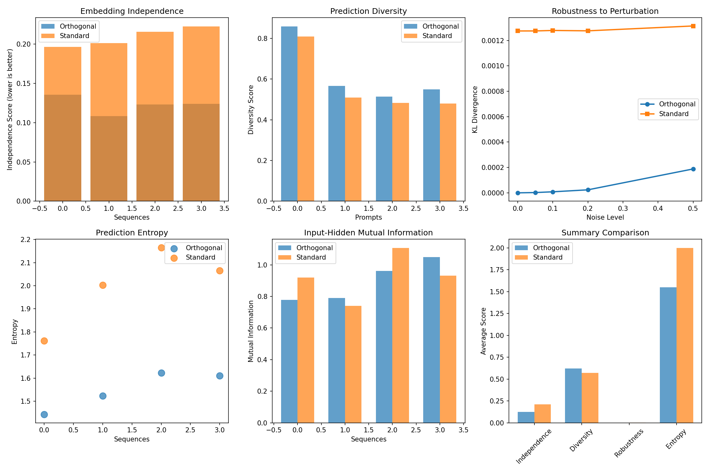

# Orthogonal Concept Transformer Analysis

## From an information dynamics perspective, standard Transformers learn an implicit latent ontology (a system of representing concepts and their relationships) through end-to-end optimization. Through orthogonal feature independence—we can promote the emergence of a more parsimonious or compositionally-structured ontology.

This repository explores the concept of using orthogonal transformations within a Transformer architecture to influence the learned latent representations. The primary goal is to investigate whether enforcing orthogonality can lead to more disentangled, robust, and interpretable models.

The core idea is implemented in `ml.py` and tested via `test_orthogonal_concept.py`.

## Key Visualizations

### Character Embedding Point Cloud (Orthogonal Model)

This plot visualizes the 2D PCA-reduced character embeddings from a set of sample words. It compares the embeddings before the orthogonal transformation ("Standard Embeddings") and after the transformation ("Inverse/Orthogonal Embeddings"). This helps to qualitatively assess how the orthogonalization reshapes the representational space.

*(You will need to run `test_orthogonal_concept.py` to generate this image. It will be saved as `orthogonal_embedding_point_cloud.png`)*

### Comprehensive Metric Analysis

The `test_orthogonal_concept.py` script also generates a comprehensive analysis of various metrics, comparing the orthogonal model against a standard Transformer baseline. These metrics include perplexity, embedding independence, prediction diversity, robustness to perturbation, and information-theoretic properties (entropy, mutual information).

*(This plot is saved as `orthogonal_concept_analysis.png` when `test_orthogonal_concept.py` is run.)*

## Running the Code
